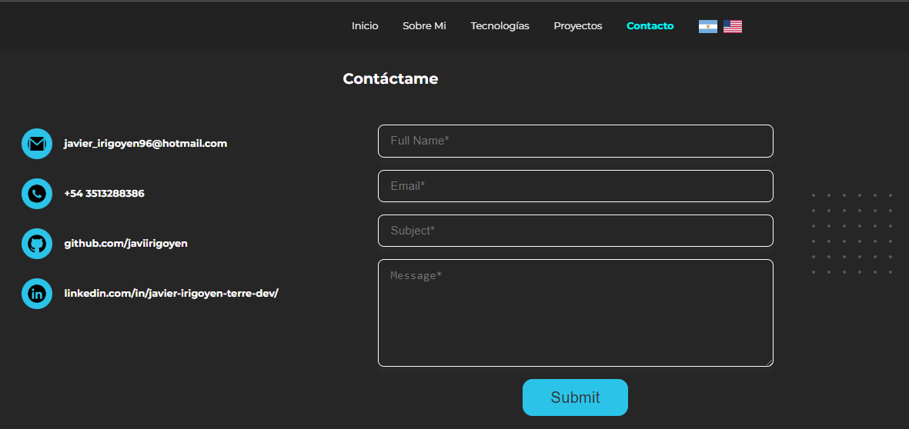

# Mi portfolio

## Descripción

Este es mi portfolio personal. En el se encuentran mis proyectos, mi datos personales, descripcion mia, como asi tambien un formulario de contacto.

## Dependencias utilizadas

- Node 12.21
- NPM 7.20.3
- React 17.0.2
- Typescript 4.5.2

Para ver todas las dependencias, puede comprobar el archivo <a href="./package.json">package.json</a>

## Instrucciones para utilizar el proyecto

- Clonar o forkear el repositorio
- Npm install
- Npm start

## Presentación y funcionalidades

### Home

Esta es la pantalla inicial de mi portfolio. En ella podrán encontrar un mensaje de bienvenida, junto a una breve descripción mía. También se encuentra mi foto de perfil. En el top, se encuentra la navbar, con acceso a todas las secciones de la web y un selector de idioma.

### About

Sección about. En ella podrán encontrar una descripción más detallada de mi persona, como también un link para descargar mi curriculum personal.

### Technologies

Sección technologies. En ella podrán encontrar las tecnologías que actualmente me destaco.

### Projects

Sección projects. En ella podrán encontrar mis proyectos personales, tanto como el link al repositorio, como el link del deploy. Cuenta con una simple animación.

### Contact

Sección contact. En ella podrán encontrar mis datos personales de contacto, así como también un formulario de contacto, donde recibirán un mail, tanto ustedes como yo, para luego poder comunicarme con ustedes. Para el email se utilizó EmailJS.

### Responsive

La web es full responsive para utilizar en la mayoria de dispositivos.
